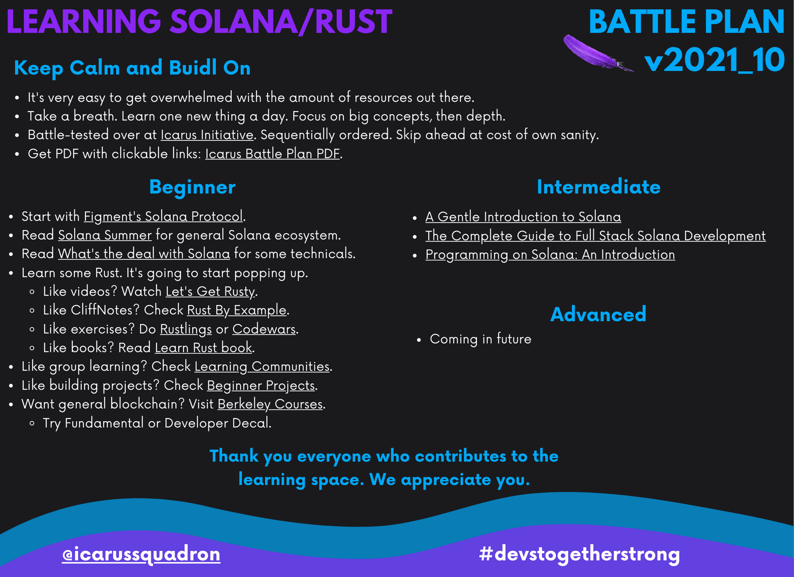

# Icarus Initiative - Resources

- Document Version 2021_10

- Welcome to an unofficial developer resource collection.
- Trying to update and trim document constantly to the best resources.
- Please tweet `@icarussquadron` for comments/suggestions/corrections. You're appreciated!
- Other questions & comments? Holler at admins on [Icarus Discord](https://discord.gg/D3kx72wJyv).

---

## Learning Solana/Rust Battle Plan (Quick Start)

> Get PDF with clickable links: [Learning Solana Rust Battle Plan PDF](https://github.com/icarus-initiative/icarus_initiative/blob/main/guides/learning_solana_rust_battle_plan.pdf).

- It's very easy to get overwhelmed with the amount of resources out there.
- Take a breath. Learn one new thing a day. Focus on big concepts, then depth later.
- Battle-tested over at [Icarus Initiative](https://icarusinitiative.net). Sequentially ordered. Skip ahead at cost of own sanity.😉

- Beginner Level:

  - Start with [Figment's Solana Protocol](https://learn.figment.io/protocols/solana).
  - Read [Solana Summer](https://www.notboring.co/p/solana-summer) for general Solana ecosystem.
  - Read [What's the deal with Solana](https://2501babe.github.io/posts/solana101.html) for some technicals.
  - Learn some Rust. It's going to start popping up.
  - Like videos? Watch [Let's Get Rusty](https://www.youtube.com/playlist?list=PLai5B987bZ9CoVR-QEIN9foz4QCJ0H2Y8).
  - Like CliffNotes? Check [Rust By Example](https://doc.rust-lang.org/stable/rust-by-example/).
  - Like exercises? Do Rustlings on [rust-lang.org](https://www.rust-lang.org/learn) or [Codewars](https://www.codewars.com/).
  - Like books? Read [Learn Rust book](https://doc.rust-lang.org/book/).
  - Like group learning? Check [Learning Communities](https://github.com/icarus-initiative/icarus_initiative/blob/main/resources.md).
  - Like building projects? Check [Beginner Projects](https://github.com/icarus-initiative/icarus_initiative/blob/main/projects.md).
  - Want general blockchain? Visit [Berkeley Courses](https://blockchain.berkeley.edu/).
    - Try Fundamental or Developer Decal.

- Intermediate Level:

  - [A Gentle Introduction to Solana (Kirima)](https://kirima.vercel.app/post/gentleintrosolana)
  - [The Complete Guide to Full Stack Solana Development (Dabit)](https://dev.to/dabit3/the-complete-guide-to-full-stack-solana-development-with-react-anchor-rust-and-phantom-3291)
  - [Programming on Solana: An Introduction with Escrow (Paulx)](https://paulx.dev/blog/2021/01/14/programming-on-solana-an-introduction/)

- Another approach is building projects and consuming resources with [Expeditions](https://github.com/icarus-initiative/icarus_initiative/blob/main/expeditions.md) as a group or solo.

---

## Learning Communities

---

### [Figment.io](http://figment.io) - Friendly Solana Protocol Tutorial and Datahub Introduction

- [Figment Discord](https://discord.com/invite/fszyM7K)
- [Introducing: The Solana Learn Pathway Crowdcast Replay 1st Edition (1hr)](https://www.youtube.com/watch?v=17XZK-ozg9U)
- [Figment Learn](https://learn.figment.io/)
- [Figment Forum (For FAQs, Troubleshooting Errors in Pathways, tech. discussion, posting tech. queries)](https://community.figment.io/)
- [DataHub (the Web3 Gateway, to complete the pathways you'll need it)](https://datahub.figment.io/)
- [Figment YouTube (For previous event recordings, pathway videos, intro videos etc)](https://www.youtube.com/channel/UCW8jHuPqYLE6bYFR30aGg9Q)
- [Tutorials](https://learn.figment.io/figment-learn/all-tutorials)
- [Solana Pathway](https://learn.figment.io/protocols/solana)
  - [SOLANA Learn Pathway Tutorial Series (Figment Learn)](https://www.youtube.com/playlist?list=PLkgTdjgP1aUAiqqbvVi3b0sSdxByd5KSX)
- [Solana Figment Articles](https://figment.io/resources/category/solona/)

---

### [Icarus Initiative](https://github.com/icarus-initiative/icarus_initiative) - A Crowdsourced Solana/Rust Learning Initiative

- [Website](https://icarusinitiative.net/)
- [Github](https://github.com/icarus-initiative)
- [Discord](https://discord.gg/D3kx72wJyv)
- [Youtube](https://www.youtube.com/channel/UCTurxUPFKUZARHQkihpMAfg)
- [Twitter](https://twitter.com/icarussquadron)

- [Icarus Readme](https://github.com/icarus-initiative/icarus_initiative/blob/main/README.md)
- [Icarus Resources](https://github.com/icarus-initiative/icarus_iniative/blob/main/resources.md)
- [Icarus Expeditions](https://github.com/icarus-initiative/icarus_initiative/blob/main/expeditions.md)
- [Icarus Squadrons](https://github.com/icarus-initiative/icarus_initiative/blob/main/squadrons.md)
- [Icarus Projects](https://github.com/icarus-initiative/icarus_initiative/blob/main/squadrons.md)
- [Icarus 1st Expedition Wallet Guidelines](https://github.com/icarus-initiative/icarus_initiative/blob/main/guides/1st_expedition_wallet_guidelines.md)
- [Icarus 2nd Expedition Smart Contracts Guidelines](https://github.com/icarus-initiative/icarus_initiative/blob/main/guides/2nd_expedition_smart_contracts_guidelines.md)

---

### [Buildspace](https://buildspace.so/)

- [Discord](https://discord.gg/mXDqs6Ubcc)

---

### [Questbook](https://www.questbook.app/)

- [Discord](https://discord.com/invite/g9MGWEeq5Z)

---

### [SOLHack.com](https://solhack.com/) - Solana Study Group

- [Discord](https://discord.gg/yRaZ23DXxM)
- [Free Courses](https://solhack.com/courses/)
- [Study Groups/Squads](https://solhack.com/squads/)
- [Learn Rust Programming with the Solhack Study Group](https://solhack.com/courses/how-rusty-is-your-rust-lang/)
  - [Article](https://solana.blog/learn-rust-programming-with-the-solhack-study-group/)
- [Programming on Solana – An Introduction](https://solhack.com/courses/programming-on-solana-an-introduction/)
  - [Article](https://paulx.dev/blog/2021/01/14/programming-on-solana-an-introduction/)
- [Building Solana Smart Contracts & dApps with James Bachini](https://solhack.com/courses/building-solana-smart-contracts-dapps-with-james-bachini/)
- [Solana Security – Audit Workshop by Solend](https://solhack.com/courses/solana-security-audit-workshop-by-solend/)

---

## Solana Resources

---

### Solana General Introduction

- [Solana Core Concepts (Community Video)](https://www.youtube.com/watch?v=4dNuMXBjpr0)
- [Soldev.app (Resource Aggregator)](https://www.soldev.app/)
- [Solana Summer Article](https://www.notboring.co/p/solana-summer)
- [Solana's Developer Resources](https://solana.com/developers)
- [ChangeHero brief introduction article](https://changehero.io/blog/what-is-solana/)
- [Solana Ecosystem](https://solana.com/ecosystem)
- [Solana Docs](https://docs.solana.com/)
- [Solana Podcast](https://podcast.solana.com/)
- [Unofficial Solana Blog](https://solana.blog/)

### Solana Careers

- [Solana Developer List](https://twitter.com/therealchaseeb/status/1411035027585044482)
- [Figment `#opportunities` channel on Discord](https://discord.com/invite/fszyM7K)
- [SOLHACK `#gig-board channel` on Discord](https://discord.gg/yRaZ23DXxM)
- [Solana Jobs](https://jobs.solana.com/)
- [Crypto Jobs List](https://cryptojobslist.com/)

### Solana Ignition Hackathon Workshop Series

- [Solana Ignition Hackathon Winners](https://solana.com/news/solana-ignition-hackathon-winners)
- [Solana Ignition Videos](https://www.youtube.com/playlist?list=PLilwLeBwGuK5Ufxsoo14bZ8sIby3ExgRx)
  - Ignition Blastoff Stream | Hackathon Project Ideas (40:51) (Recommended)
  - Figment Solana Learn Pathway 2nd Edition (46:46) (Recommended)
  - How to Anchor: An introduction to the Anchor Framework (1:07:59) (Recommended)
  - NFT / Metaplex Workshop (56:42)(Recommended for NFT enthusiasts)
  - The Future of Blockchain Gaming (55:01) (Recommended for GameFi enthusiasts)
  - Mango DAO Demo (1:07:28) (Recommended for DAO enthusiasts)

---

## Solana Learning Tracks

---

### General Solana Track

- [Solana Start Kit (ironaddicteddog)](https://hackmd.io/@ironaddicteddog/solana-starter-kit)
- [Example Hello World](https://github.com/solana-labs/example-helloworld)
- [A Gentle Introduction to Solana](https://kirima.vercel.app/post/gentleintrosolana)
- [Solana teardown: Walkthrough of the example helloworld program](https://dev.to/cogoo/solana-teardown-walkthrough-of-the-example-helloworld-program-18m4)
- [Solana dApp scaffold](https://github.com/solana-labs/dapp-scaffold)
- [Wallet Adapter](https://github.com/solana-labs/wallet-adapter)
- [Web3.js SDK](https://github.com/solana-labs/solana-web3.js)
- [Programming Solana (Youtube - David Choi)](https://www.youtube.com/playlist?list=PL41Cw3fN3CfdbmhgxADwyDyIoDrxc22v2)
- [Intro to the Solana Programming Model - Technical Workshop](https://www.youtube.com/watch?v=7Iitv5tMOMY)
- [Solana - 8 Key Innovations Simplified and Analogized](https://hashnode.com/post/solana-8-key-innovations-simplified-and-analogized-cku5q6zeh0jdsp9s1f9tp6ch6)
- [Solana's 8 Innovations](https://medium.com/solana-labs/7-innovations-that-make-solana-the-first-web-scale-blockchain-ddc50b1defda)
- [Solana Dev Blog (Jstary)](https://jstarry.notion.site/jstarry/Solana-Dev-Blog-302b7e08652c4a2dbc0be4f6a3b0d317)
- [Build Solana Anchor Blog with Svelte Front end Tutorial - Part 1 (Doug Anderson)](https://www.youtube.com/watch?v=w-n87Aq3f8k)
- [Solana Anchor Part2: Deploy! -- High Def Code Walkthrough (Doug Anderson)](https://www.youtube.com/watch?v=gy4iNEUUyBo)

### Community Contributed

- [How to read docs.rs](http://blog.frqc.info/post/how-to-read-rust-docs/)
- [Code Challenges work through](https://github.com/SRITANU/SolHack_Rust_StudyGroup)
- [Common Programming Problems](https://adriann.github.io/programming_problems.html)

### Smart Contracts Track (FYI Solana Smart Contracts are called Programs)

- [What's the deal with Solana (Hana)](https://2501babe.github.io/posts/solana101.html)
- [Learning How to Build on Solana (Brianfriel)](https://www.brianfriel.xyz/learning-how-to-build-on-solana/)
- [Understanding Program Derived Addresses (Brianfriel)](https://www.brianfriel.xyz/understanding-program-derived-addresses/)
- [Solana: How to send custom instructions via instruction data (Cogoo)](https://dev.to/cogoo/solana-how-to-send-custom-instructions-via-instruction-data-4g9g)
- [Programming on Solana: An Introduction (Paulx)](https://paulx.dev/blog/2021/01/14/programming-on-solana-an-introduction/)
- [The Complete Guide to Full Stack Solana Development with React, Anchor, Rust, and Phantom (Dabit)](https://dev.to/dabit3/the-complete-guide-to-full-stack-solana-development-with-react-anchor-rust-and-phantom-3291)
- [Create a fullstack mail dApp on Solana (Figment)](https://learn.figment.io/tutorials/create-a-fullstack-mail-dapp-on-solana)
- [How to Build and Deploy a Solana Smart Contract (Harsh Patel)](https://hashnode.com/post/anchor-framework-simplified-for-new-developers-in-solana-cktyttmwf09h6bps189wxcngd)
- [Solana Smart Contracts: Common Pitfalls and How to Avoid Them](https://blog.neodyme.io/posts/solana_common_pitfalls)

### Anchor Track

- [Anchor Example: Escrow Program](https://hackmd.io/@ironaddicteddog/anchor_example_escrow)
- [Anchor Framework simplified for new developers in Solana](https://hashnode.com/post/anchor-framework-simplified-for-new-developers-in-solana-cktyttmwf09h6bps189wxcngd)
- [Anchor](https://project-serum.github.io/anchor/getting-started/introduction.html)
  - [Anchor Discord](discord.gg/PDeRXyVURd.)
- [Programming Solana Smart Contracts | Hello World Anchor Tutorial (Youtube - HenryE)](https://www.youtube.com/watch?v=oD1umX_DnUw)
- [Programming Solana Smart Contracts | Intermediate Anchor Tutorial (Youtube - HenryE)](https://www.youtube.com/watch?v=i6Ycr5nhjH8)

### DAOs Track

- [A Simple Solana Dapp Tutorial (Voting Dapp by Smith MCF)](https://smith-mcf.medium.com/a-simple-solana-dapp-tutorial-6dedbdf65444)
- [Solana Dapp Tutorial - Demo 1.6 (Voting Dapp)](https://odysee.com/@MCF:0/Solana-Simple-Dapp-Tutorial-Deploy-Demo:2)

### NFTs Track

- [Solana and Metaplex FAQ](https://hackmd.io/@archaeopteryx/By4bpbA4F)
- [Create a Solana NFT marketplace and mint NFTs using Metaplex (Figment)](https://learn.figment.io/tutorials/create-a-solana-nft-marketplace-with-metaplex)
- [Solseum NFT Generator for Solana!](https://hackmd.io/@Solseum/HJEfeFDNt)
- [Metaplex](https://www.metaplex.com/)
  - [Metaplex Tutorial](https://solana.blog/solana-metaplex-tutorial-deploy-your-own-store-mint-nfts-and-setup-auctions/)
  - [Repository](https://github.com/metaplex-foundation/metaplex)
  - [Metaplex Developer Guide](https://www.notion.so/Metaplex-Developer-Guide-afefbc19841744c28587ab948a08cfac)
- [Metaplex Candy Machine + Custom SPL Token](https://docs.google.com/document/d/1ZJsbLJXKCAqUsOU6a0Jk-yOuSYi-uOMYdQZIILGsvxE/edit)
- [Metaboss](https://github.com/samuelvanderwaal/metaboss)
- [Guide to Airdrop Using Metaplex](https://hackmd.io/@8LSEewFFQ2OwXMjUKZP-pA/HJ7jMxYEF)

### GameFi Track

- [DeFi Hackathon](https://github.com/solana-labs/defi-hackathon/)
- [Solana Game Projects](https://github.com/murlokito/awesome-solana-gaming)

### DeFi Track

- [Oyster Swap](https://github.com/solana-labs/oyster-swap)

### Mobile Track

- [Valholla](https://github.com/JohnRSim/valholla)

### Utility Track

- [Solana JSON](https://github.com/jamesbachini/Solana-JSON)

---

## Rust Resources

---

### Rust Books & Websites

- [Rust Language Cheatsheet](https://cheats.rs/)
- [Rust Learning Resources by Figment.io](https://learn.figment.io/network-documentation/extra-guides/rust-learning-resources)
- [Tour of Rust](https://tourofrust.com/)
- [Learn Rust](https://www.rust-lang.org/learn)
  - [The Rust Programming Language Book](https://doc.rust-lang.org/book/)
  - [The Rust Reference](https://doc.rust-lang.org/reference/index.html)
  - [Rust By Example Book](https://doc.rust-lang.org/stable/rust-by-example/)
  - [Rustlings](https://github.com/rust-lang/rustlings/)
  - [Rust Documentation to search for methods (Javascript MDN for Rust basically)](https://doc.rust-lang.org/std/index.html)
- [A half-hour to learn Rust](https://fasterthanli.me/articles/a-half-hour-to-learn-rust)
- [Learn X in Y Minutes - Rust Edition](https://learnxinyminutes.com/docs/rust/)
- [Rust in Action by TS McNamara](https://www.amazon.com/dp/1617294551/ref=cm_sw_r_cp_api_glt_fabc_YMQ1B92QFKHPKS19F3C5?_encoding=UTF8&psc=1)
- [Hands-on Rust: Effective Learning through 2D Game Development and Play by Herbert Wolverson](https://www.amazon.com/dp/1680508164/ref=cm_sw_r_cp_api_glt_fabc_GPN0F8927DWD5CDGTYJ6)
- [Programming Rust: Fast, Safe Systems Development by Jim Blandy](https://www.amazon.com/dp/1492052590/ref=cm_sw_r_cp_api_glt_fabc_0YXENRKRS0CEGJA4CZJJ)
- [Hands-On Systems Programming with Rust by Ken Yoeun-Clark](https://www.oreilly.com/library/view/hands-on-systems-programming/9781098109424/)
- [Rust for Rustaceans: Idiomatic Programming for Experienced Developers by John Gjengset](https://www.amazon.com/dp/1718501854/ref=cm_sw_r_cp_api_glt_fabc_HS4N72GEH09839F04XC5)

---

### Rust Youtube Channels

- [Let's Get Rusty](https://www.youtube.com/playlist?list=PLai5B987bZ9CoVR-QEIN9foz4QCJ0H2Y8)
  - [Let's Get Rusty Cheatsheet](https://letsgetrusty.com/)
- [John Gjengset](https://www.youtube.com/channel/UC_iD0xppBwwsrM9DegC5cQQ)
- [Rust Programming Language Playlist (Youtube - dcode)](https://www.youtube.com/watch?v=vOMJlQ5B-M0&list=PLVvjrrRCBy2JSHf9tGxGKJ-bYAN_uDCUL&index=2)
- [How To Build a Simple API in Rust (Part 1)](https://hackernoon.com/how-to-build-a-simple-api-in-rust-part-1-eg2037oo)
- [Jeremy Chone](https://www.youtube.com/channel/UCiT_r1GD7JSftnbViKHcOtQ)
- [Rust Tutorial with Doug Milford](https://www.youtube.com/playlist?list=PLLqEtX6ql2EyPAZ1M2_C0GgVd4A-_L4_5)

---

### Rust Courses

- [Microsoft's Beginner's Series to Rust Course (Youtube: Microsoft Developer)](<https://www.youtube.com/playlist?list=PLlrxD0HtieHjbTjrchBwOVks_sr8EVW1x](https://www.youtube.com/playlist?list=PLlrxD0HtieHjbTjrchBwOVks_sr8EVW1x)>)
  - [Associated Github Repo](<https://github.com/microsoft/beginners-series-rust](https://github.com/microsoft/beginners-series-rust)>)
  - [Microsoft Rust Learning Path](<https://docs.microsoft.com/en-us/learn/paths/rust-first-steps/?WT.mc_id=academic-29077-cxa](https://docs.microsoft.com/en-us/learn/paths/rust-first-steps/?WT.mc_id=academic-29077-cxa)>)
- [LinkedIn Learning's Rust Essential Training](<https://www.linkedin.com/learning/rust-essential-training](https://www.linkedin.com/learning/rust-essential-training)>)

---

### Blockchain Courses

- [Crypto Startup School (Learn How to Build a Crypto Company)](https://a16z.com/crypto-startup-school/)
- [IntelliJ Idea's EduTools plugin has Rustling course](https://plugins.jetbrains.com/plugin/10081-edutools)
- Blockchain at Berkeley - Additional Free Blockchain Courses
  - [Starter](https://figment.io/resources/blockchain-at-berkeley-partners-with-figment-on-web-3-learning/)
  - [Courses](https://blockchain.berkeley.edu/)
    - [Blockchain Fundamentals Decal](https://blockchain.berkeley.edu/courses/spring-2021-fundamentals-decal/)
    - [Blockchain Developers Decal](https://blockchain.berkeley.edu/courses/spring-2021-developers-decal/)
    - [Bitcoin and Cryptocurrencies EdX](https://www.edx.org/course/bitcoin-and-cryptocurrencies)
    - [Blockchain Technology edX](https://www.edx.org/course/blockchain-technology)
  - [Consensys Academy](https://consensys.net/academy/)
  - [Chainshot (Ethereum Specific)](https://www.chainshot.com/)
  - [Blockchain and Money (Gary Gensler)](https://ocw.mit.edu/courses/sloan-school-of-management/15-s12-blockchain-and-money-fall-2018/)

---

### Rust Community

- [Rust-lang Forums](https://users.rust-lang.org/)
- [Rust-lang Discord](https://discord.com/invite/rust-lang)
- [Rust-lang Twitter](https://twitter.com/rustlang)
- [Rust-lang Zulipchat](https://rust-lang.zulipchat.com/login/)
- [Rust-conf](https://rustconf.com/)
- [This Week in Rust](https://this-week-in-rust.org/)

---
